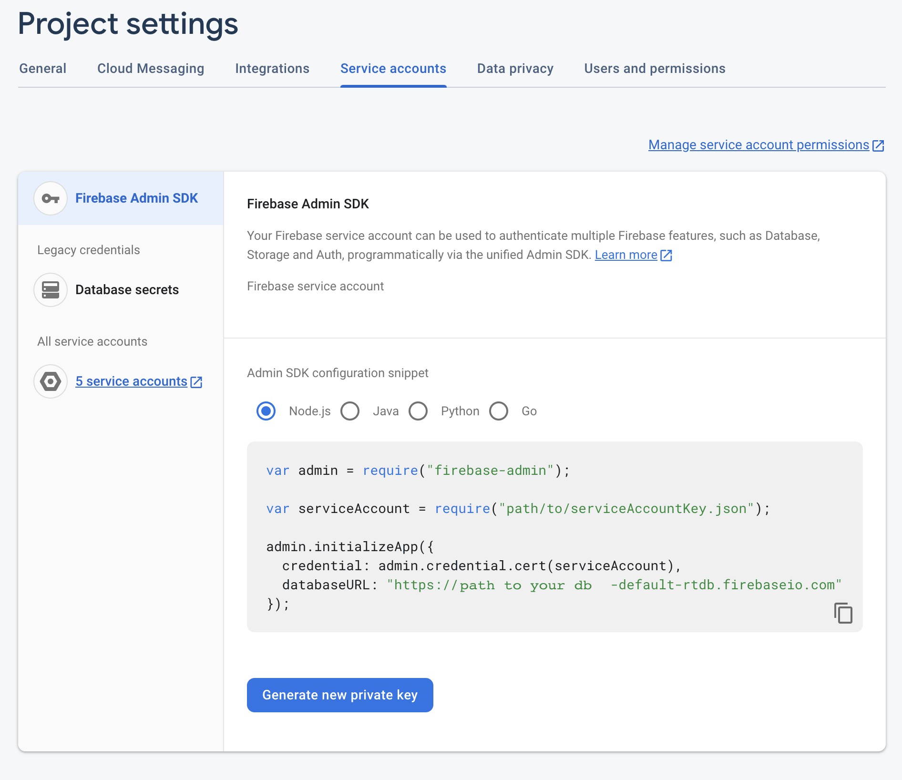

# Setting Up The Firebase Admin SDK
The ```Firebase Admin SDK``` are a set of libraries that allow you to connect and use firebase services from a remote service locaiton. 

## How to Configure Admin SDK with NEXT.js
To setup the Firebase Admin SDK for a ```NEXT.js``` start by creating a folder in the root of your applicaiton. For the employees example call the folder ```config```.
```shell
.
├── README.md
├── app
├── config
├── data
├── docs
├── jsconfig.json
├── next.config.js
├── node_modules
├── package-lock.json
├── package.json
├── postcss.config.js
├── public
└── tailwind.config.js
```

## Service Account Private Key
A Firebase Service Account Key is a way for you to authenticate your app on the Google servers. This file contains information about your account and your project. To create a service account go to your firebase client dashboard for the project.  
Locate the service accounts tab in the project settings.  

  

<br/>
<br/>

Once you have the key downloaded move it into the config folder and rename it. Keep the .json file extension.

```shell
config
└── serviceAccountKey.json
```


## Create the Connection

```js

var admin = require("firebase-admin");
var {initializeApp, getApps} = require("firebase-admin/app")

// service Account Key
var serviceAccount = require("path-to-your-service-key.json");

// singleton
 if(!getApps().length){
  initializeApp({
    credential: admin.credential.cert(serviceAccount),
    databaseURL: "https://coursecontent-db812-default-rtdb.firebaseio.com",
    databaseAuthVariableOverride: {
      uid: "your-service-account"
    }
  });
 }

// app/api/test/route.js
const db = admin.database()

export {db}

```
 

 ## Create A Test Route